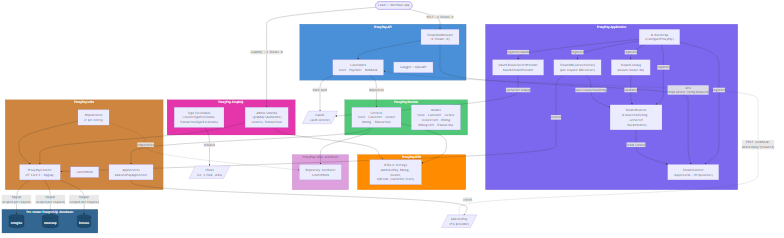

# ProxyPay — Multi-tenant PIX Payment Orchestration API


## Overview

**ProxyPay** is a multi-tenant backend API that orchestrates PIX billings,
invoices, QR codes and payment webhooks for merchant stores, acting as a
thin integration and persistence layer on top of
[AbacatePay](https://abacatepay.com). Each merchant tenant gets its own
PostgreSQL database, its own JWT signing key and its own AbacatePay
webhook URL — isolation is **physical**, not row-level. The project is
written in **.NET 8** following Clean Architecture and exposes both REST
and GraphQL endpoints.

Today the platform runs three active tenants: `emagine` (primary), `monexup`,
and `fortuno`. New tenants can be added by configuration (no code change)
through the `Tenants:{tenantId}` section of `appsettings.*.json` or the
matching `Tenants__{tenantId}__*` environment variables injected by Docker
Compose.

Authentication is delegated to the external **NAuth** service; each tenant
validates tokens with its own secret via a custom
`NAuthTenantSecretProvider`, so a token emitted for tenant A is never
accepted under tenant B.

---

## 🚀 Features

- 🏢 **Physical multi-tenancy** — one PostgreSQL database per tenant resolved per request via `TenantDbContextFactory`
- 🔑 **Per-tenant JWT secrets** — NAuth validates each token with the secret of the tenant on the request, cross-tenant tokens are rejected
- 🧭 **Header-driven tenant resolution** — `X-Tenant-Id` on every request (REST, GraphQL, webhooks via path segment)
- 💸 **AbacatePay integration** — create billings, PIX QR codes, check status, and receive payment webhooks
- 🧾 **Invoice & transaction lifecycle** — full PIX payment journey from QR generation through status polling and webhook confirmation
- 📊 **GraphQL admin schema** — HotChocolate endpoint (`/graphql`) with `[UseProjection]`, filtering and sorting over invoices and transactions
- 📖 **Swagger / OpenAPI** — interactive API docs enabled in Development and Docker environments
- 🔐 **Basic-token authentication** — NAuth `Authorization: Basic {token}` flow with `[Authorize]` controllers
- 🗃️ **EF Core 9 migrations** — schema managed via `dotnet ef`, per-tenant physical isolation prevents row-level bleed
- 🧱 **Clean Architecture** — eight .NET projects with explicit dependency direction and centralized DI bootstrap in `ProxyPay.Application`

---

## 🛠️ Technologies Used

### Core Framework

- **.NET 8** + **ASP.NET Core** — runtime, REST controllers, middleware pipeline
- **Clean Architecture** — Domain / Application / Infra / DTO / Infra.Interfaces / API / GraphQL layering

### Database

- **PostgreSQL 17** — one physical database per tenant
- **Entity Framework Core 9.0.8** with **Npgsql** — ORM, lazy-loading proxies, migrations via `dotnet ef`

### GraphQL

- **HotChocolate 14.3.0** — admin schema on `/graphql`, `[Authorize]` at class level, IQueryable projection for EF Core

### Authentication & External Services

- **NAuth 0.5.9** — Basic-token auth with dynamic per-tenant `ITenantSecretProvider`
- **zTools** — external service for S3 uploads, e-mail (MailerSend) and utilities
- **AbacatePay** — PIX billing, QR-code and webhook provider

### Additional Libraries

- **FluentValidation 12.1.1** — request validation (e.g., `QRCodeRequestValidator`)
- **AutoMapper 13.0.1** — entity ↔ DTO mapping (Invoice, Transaction, Customer, Store, Billing profiles)
- **Newtonsoft.Json** — AbacatePay wire format (camelCase contract resolver)
- **Serilog** — structured logging, console sink with template output
- **Swashbuckle 9.0.4** — OpenAPI v2 Swagger generation

### Testing

- **xUnit 2.9.2** + **Moq 4.20.72** — test project (`ProxyPay.Tests`) scaffolded; integration harness yet to be filled in

### DevOps

- **Docker** + **Docker Compose** — two compose files (`docker-compose.yml` for dev, `docker-compose-prod.yml` for prod)
- **GitHub Actions** — `deploy-prod.yml`, `create-release.yml`, `version-tag.yml`
- **GitVersion** — semantic versioning configuration in `GitVersion.yml`
- **Bruno** — API collection in `bruno/` for manual/regression testing

---

## 📁 Project Structure

```
ProxyPay/
├── ProxyPay.API/                        # ASP.NET Core host: Controllers, Startup, Middleware, appsettings
│   ├── Controllers/                     # StoreController, PaymentController, WebhookController, GraphQLController
│   ├── Middlewares/                     # TenantMiddleware (reads X-Tenant-Id → HttpContext.Items)
│   ├── Filters/                         # GlobalExceptionFilter
│   ├── Dockerfile                       # Container image definition
│   └── appsettings.{Development,Docker,Production}.json
├── ProxyPay.Application/                # DI bootstrap + multi-tenant plumbing
│   ├── Startup.cs                       # ConfigureProxyPay extension (DI composition root)
│   ├── TenantContext.cs                 # ITenantContext + AsyncLocal EnterScope(...)
│   ├── TenantResolver.cs                # ITenantResolver (ConnectionString, JwtSecret, BucketName per tenant)
│   ├── TenantCatalog.cs                 # ITenantCatalog (active tenant ids, existence check)
│   ├── TenantDbContextFactory.cs        # Per-request DbContext with tenant's connection string
│   ├── NAuthTenantSecretProvider.cs     # Dynamic per-tenant JWT secret for NAuth
│   └── NAuthTenantProvider.cs           # Tenant provider for outbound NAuth calls
├── ProxyPay.Domain/                     # Business logic and entities
│   ├── Models/                          # Store, Customer, Invoice, InvoiceItem, Billing, BillingItem, Transaction
│   ├── Services/                        # InvoiceService, TransactionService, CustomerService, StoreService, BillingService
│   ├── Interfaces/                      # ITenantContext, ITenantResolver, ITenantCatalog, service contracts
│   └── Validators/                      # FluentValidation validators (QRCodeRequestValidator, ...)
├── ProxyPay.DTO/                        # Shared DTOs and settings
│   ├── AbacatePay/                      # Wire-format types for AbacatePay integration
│   ├── Billing/ Invoice/ Customer/      # Request/response DTOs per domain
│   └── Settings/                        # NAuthSetting, zToolsetting, AbacatePaySetting
├── ProxyPay.Infra/                      # EF Core, repositories, AppServices
│   ├── Context/ProxyPayContext.cs       # EF Core DbContext (7 DbSets)
│   ├── Migrations/                      # EF Core migrations (PostgreSQL)
│   ├── Repository/                      # 7 repositories (one per aggregate root)
│   ├── AppServices/                     # AbacatePayAppService (outbound HTTP)
│   ├── Mappers/                         # AutoMapper profiles
│   └── UnitOfWork.cs                    # Transaction coordination
├── ProxyPay.Infra.Interfaces/           # Repository + AppService contracts
├── ProxyPay.GraphQL/                    # HotChocolate schema
│   ├── Admin/AdminQuery.cs              # Admin queries (requires [Authorize])
│   ├── Types/                           # InvoiceTypeExtension, TransactionTypeExtension
│   ├── GraphQLServiceExtensions.cs      # AddProxyPayGraphQL DI
│   └── GraphQLErrorLogger.cs            # Diagnostic listener
├── ProxyPay.Tests/                      # xUnit test project (scaffold)
├── bruno/                               # Bruno API collection (GraphQL, Payment, Store, Webhook)
├── docs/                                # Additional documentation + architecture diagram
├── specs/                               # GitHub spec-kit feature specs (dev tooling)
├── .specify/                            # Spec-kit templates, memory and scripts
├── .github/workflows/                   # GitHub Actions: deploy-prod, create-release, version-tag
├── docker-compose.yml                   # Local dev (API + Postgres)
├── docker-compose-prod.yml              # Production (API only, external DB)
├── proxypay.sql                         # Raw schema snapshot (complementary to EF migrations)
├── GitVersion.yml                       # SemVer tooling
├── ProxyPay.sln                         # Solution file
├── LICENSE                              # MIT
└── README.md                            # This file
```

---

## 🏗️ System Design

The following diagram illustrates the high-level architecture of **ProxyPay**:



A request flows through `TenantMiddleware`, which reads `X-Tenant-Id` from
the HTTP header (or from the path segment for AbacatePay webhooks) and
publishes it into the request scope. `TenantResolver` reads the current
tenant and exposes its `ConnectionString`, `JwtSecret` and `BucketName`
from `IConfiguration`. `TenantDbContextFactory` builds a **per-request**
`ProxyPayContext` pointing at the correct physical database.
`NAuthTenantSecretProvider` resolves the JWT secret dynamically, so NAuth
only accepts tokens signed by the tenant of the current request.
Outbound calls to AbacatePay and NAuth are issued from
`ProxyPay.Infra.AppServices` and the NAuth ACL clients registered in DI.

> 📄 **Source:** the editable Mermaid source is available at [`docs/system-design.mmd`](docs/system-design.mmd).

---

## 📖 Additional Documentation

| Document | Description |
|----------|-------------|
| [API_REFERENCE.md](docs/API_REFERENCE.md) | Comprehensive REST + GraphQL reference: endpoints, payloads, response shapes |
| [ABACATE_PAY.md](docs/ABACATE_PAY.md) | Integration guide for AbacatePay — PIX flows, webhooks, error handling |
| [system-design.mmd](docs/system-design.mmd) | Mermaid source for the architecture diagram |

---

## ⚙️ Environment Configuration

ProxyPay reads its configuration from `appsettings.{Environment}.json`
(for `dotnet run`) and from environment variables prefixed with
`Tenants__{tenantId}__*` (for Docker). A template is provided.

### 1. Copy the environment template

```bash
cp .env.example .env
```

For production:

```bash
cp .env.prod.example .env.prod
```

### 2. Edit the `.env` file

```bash
# Database (used by the docker-compose Postgres service)
POSTGRES_USER=proxypay_user
POSTGRES_PASSWORD=your_secure_password_here_change_this
POSTGRES_DB=proxypay_db

# Tenant: emagine (default)
EMAGINE_CONNECTION_STRING=Host=proxypay-db;Port=5432;Database=proxypay_emagine_dev;Username=proxypay_user;Password=your_secure_password_here_change_this
EMAGINE_JWT_SECRET=generate_a_base64_256bit_secret_here

# Tenant: monexup
MONEXUP_CONNECTION_STRING=Host=proxypay-db;Port=5432;Database=proxypay_monexup_dev;Username=proxypay_user;Password=your_secure_password_here_change_this
MONEXUP_JWT_SECRET=generate_a_distinct_base64_256bit_secret_here

# Tenant: fortuno
FORTUNO_CONNECTION_STRING=Host=proxypay-db;Port=5432;Database=proxypay_fortuno_dev;Username=proxypay_user;Password=your_secure_password_here_change_this
FORTUNO_JWT_SECRET=generate_a_distinct_base64_256bit_secret_here

# Shared services
PROXYPAY_BUCKET_NAME=proxypay
NAUTH_API_URL=https://your-nauth-host/auth-api
NAUTH_BUCKET_NAME=nauth
ZTOOLS_API_URL=https://your-ztools-host/tools-api

# AbacatePay (moves to per-tenant in a follow-up)
ABACATEPAY_API_KEY=your_abacatepay_api_key
ABACATEPAY_WEBHOOK_SECRET=your_abacatepay_webhook_secret

# App
APP_PORT=5000
```

⚠️ **IMPORTANT**:
- Never commit `.env` or `.env.prod` with real credentials — only `.env.example` / `.env.prod.example` are version-controlled
- Each tenant **MUST** have a distinct `JwtSecret`; sharing secrets breaks the isolation guarantee
- Each tenant **MUST** point at a different physical database — startup fails if two tenants share the same ConnectionString
- Rotate all default passwords and secrets before deployment

---

## 🐳 Docker Setup

### Quick Start with Docker Compose

#### 1. Prerequisites

The compose file expects an external network named `emagine-network`.
Create it once per host:

```bash
docker network create emagine-network
```

Then copy the env template (see section above).

#### 2. Build and Start Services

```bash
docker-compose up -d --build
```

This spins up two containers:

- `proxypay-db` — PostgreSQL 17 (port `5432`)
- `proxypay-api` — the API (host port defined by `APP_PORT`, default `5000` → container `80`)

#### 3. Verify Deployment

```bash
docker-compose ps
docker-compose logs -f api
```

### Accessing the Application

| Service | URL |
|---------|-----|
| **API (health check)** | http://localhost:5000/ |
| **Swagger UI (Docker env)** | http://localhost:5000/swagger/ui |
| **GraphQL endpoint** | http://localhost:5000/graphql |

### Docker Compose Commands

| Action | Command |
|--------|---------|
| Start services | `docker-compose up -d` |
| Start with rebuild | `docker-compose up -d --build` |
| Stop services | `docker-compose stop` |
| View status | `docker-compose ps` |
| View logs | `docker-compose logs -f` |
| Remove containers | `docker-compose down` |
| Remove containers and volumes (⚠️ drops DB data) | `docker-compose down -v` |

---

## 🔧 Manual Setup (Without Docker)

### Prerequisites

- [.NET 8 SDK](https://dotnet.microsoft.com/download)
- PostgreSQL 17 running locally or reachable over the network
- `dotnet-ef` CLI tool: `dotnet tool install --global dotnet-ef`

### Setup Steps

#### 1. Create per-tenant databases

```bash
psql -U proxypay_user -c "CREATE DATABASE proxypay_emagine_dev;"
psql -U proxypay_user -c "CREATE DATABASE proxypay_monexup_dev;"
psql -U proxypay_user -c "CREATE DATABASE proxypay_fortuno_dev;"
```

#### 2. Apply EF Core migrations to each tenant

```bash
# emagine
dotnet ef database update --project ProxyPay.Infra --startup-project ProxyPay.API \
  --connection "Host=localhost;Port=5432;Database=proxypay_emagine_dev;Username=proxypay_user;Password=..."

# monexup
dotnet ef database update --project ProxyPay.Infra --startup-project ProxyPay.API \
  --connection "Host=localhost;Port=5432;Database=proxypay_monexup_dev;Username=proxypay_user;Password=..."

# fortuno
dotnet ef database update --project ProxyPay.Infra --startup-project ProxyPay.API \
  --connection "Host=localhost;Port=5432;Database=proxypay_fortuno_dev;Username=proxypay_user;Password=..."
```

#### 3. Build and run the API

```bash
dotnet build ProxyPay.sln
dotnet run --project ProxyPay.API
```

The API will be available on the HTTPS/HTTP ports declared by
`ASPNETCORE_URLS` (by default `https://localhost:44374` in Development).

---

## 🧪 Testing

### Running Tests

**All tests:**

```bash
dotnet test ProxyPay.sln
```

**A single project:**

```bash
dotnet test ProxyPay.Tests/ProxyPay.Tests.csproj
```

### Test Structure

The `ProxyPay.Tests` project targets **.NET 9** (test host) and uses
**xUnit** with **Moq** for mocks.

```
ProxyPay.Tests/
├── Domain/                      # (planned) domain-level unit tests
├── Integration/                 # Integration tests — currently scaffolded,
│                                #  infrastructure (WebApplicationFactory,
│                                #  per-tenant DB fixtures) still pending
└── ProxyPay.Tests.csproj        # xUnit 2.9.2 + Moq 4.20.72
```

Integration tests live in `ProxyPay.Tests/Integration/` and are marked
`[Fact(Skip=...)]` until the WebApplicationFactory harness and per-tenant
database fixtures are in place.

---

## 📚 API Documentation

ProxyPay exposes **REST** and **GraphQL** surfaces. Both require the
`X-Tenant-Id` header so requests can be routed to the correct physical
database.

### Authentication Flow

```
1. Client obtains Basic token from NAuth for a specific tenant
 → 2. Client calls ProxyPay with:
      Authorization: Basic {token}
      X-Tenant-Id: {tenant}
 → 3. TenantMiddleware stores the tenant in HttpContext
 → 4. NAuth validates the token with the tenant-specific JwtSecret
 → 5. Controller executes against the tenant's own PostgreSQL database
```

### Key Endpoints

| Method | Endpoint | Description | Auth |
|--------|----------|-------------|------|
| `GET` | `/` | Health check (JSON with `statusApplication`) | No |
| `GET` | `/swagger/ui` | Swagger UI (Dev + Docker only) | No |
| `POST` | `/graphql` | HotChocolate admin schema (Invoices, Transactions) | Yes |
| `POST` | `/store/insert` | Create a merchant store | Yes |
| `POST` | `/store/update` | Update a merchant store | Yes |
| `POST` | `/payment/billing` | Create an AbacatePay billing | No (tenant header + ClientId) |
| `POST` | `/payment/invoice` | Create an invoice | No (tenant header + ClientId) |
| `POST` | `/payment/qrcode` | Create a PIX QR code | No (tenant header + ClientId) |
| `GET` | `/payment/qrcode/status/{invoiceId}` | Check QR-code status | No |
| `POST` | `/webhook/abacatepay` | Receive AbacatePay webhooks | No (secret query param) |

> 📖 **Full reference:** detailed payloads, response shapes and error
> behavior are documented in [`docs/API_REFERENCE.md`](docs/API_REFERENCE.md).
> AbacatePay-specific flows are covered in [`docs/ABACATE_PAY.md`](docs/ABACATE_PAY.md).

### Bruno collection

A runnable Bruno collection is committed in `bruno/` with folders for
`GraphQL`, `Payment`, `Store`, and `Webhook` requests plus per-environment
variables under `bruno/environments/`. Open it in
[Bruno](https://usebruno.com) to exercise the API interactively.

---

## 🔒 Security Highlights

- **Physical tenant isolation** — each tenant owns a dedicated PostgreSQL database; cross-tenant data leakage is prevented at the storage layer rather than relying on row-level filters
- **Per-tenant JWT secrets** — `NAuthTenantSecretProvider` resolves the secret dynamically per request, so a token from tenant A is rejected under tenant B
- **`[Authorize]` on sensitive controllers** — `StoreController` and the admin GraphQL schema require authentication
- **Startup invariant** — `Program.cs` refuses to boot if two tenants share the same `ConnectionString`, catching misconfiguration before any traffic is served
- **Secrets kept out of responses** — no connection string, JWT secret, or stack trace is ever returned to clients (follows the project [constitution §V](.specify/memory/constitution.md))

---

## 🚀 Deployment

### Development Environment

```bash
dotnet run --project ProxyPay.API
```

### Production Environment

Production uses the `docker-compose-prod.yml` stack (API only — database
is an external managed PostgreSQL instance), pointing at the tenant
databases defined in `.env.prod`:

```bash
docker-compose -f docker-compose-prod.yml up -d --build
```

The deploy pipeline (`.github/workflows/deploy-prod.yml`) automates this
over SSH — see the **CI/CD** section below.

---

## 🔄 CI/CD

### GitHub Actions

| Workflow | Purpose |
|----------|---------|
| [`deploy-prod.yml`](.github/workflows/deploy-prod.yml) | On push to `main` (or manual dispatch), SSH into the production host, pull the latest `main`, rebuild and restart the compose stack |
| [`create-release.yml`](.github/workflows/create-release.yml) | Create a GitHub Release from tags |
| [`version-tag.yml`](.github/workflows/version-tag.yml) | Manage version tagging (driven by `GitVersion.yml`) |

**Required repository secrets** for `deploy-prod.yml`:

- `PROD_SSH_HOST`, `PROD_SSH_USER`, `PROD_SSH_PASSWORD`, `PROD_SSH_PORT` (optional)

The deploy script expects the repo to live under `/opt/proxypay` on the
remote host and uses `git reset --hard origin/main` for idempotent updates.

---

## 🤝 Contributing

Contributions are welcome — especially around filling in the
`ProxyPay.Tests` integration harness and adding new tenants.

### Development Setup

1. Fork the repository
2. Create a feature branch (`git checkout -b feature/AmazingFeature`)
3. Follow the project constitution in [`.specify/memory/constitution.md`](.specify/memory/constitution.md) — especially the five non-negotiable principles on stack, naming and multi-tenancy
4. Run the build and tests (`dotnet build ProxyPay.sln && dotnet test`)
5. Commit your changes (`git commit -m 'Add some AmazingFeature'`)
6. Push to the branch (`git push origin feature/AmazingFeature`)
7. Open a Pull Request

### Coding Standards (enforced by the constitution)

- **.NET conventions** — PascalCase, file-scoped namespaces, `_camelCase` private fields, `[JsonPropertyName("camelCase")]` on DTOs
- **PostgreSQL conventions** — `snake_case` tables and columns, `{entity}_id` bigint PKs, `ClientSetNull` delete behavior
- **Clean Architecture layering** — new entities/services/repositories must follow the `dotnet-architecture` skill
- **Stack is frozen** — EF Core is the only ORM; no Docker commands in the local dev loop

---

## 👨‍💻 Author

Developed by **[Rodrigo Landim Carneiro](https://github.com/emaginebr)** and contributors.

---

## 📄 License

This project is licensed under the **MIT License** — see the
[LICENSE](LICENSE) file for details.

---

## 🙏 Acknowledgments

- Built on [.NET 8](https://dotnet.microsoft.com/) and [ASP.NET Core](https://learn.microsoft.com/aspnet/core/)
- GraphQL powered by [HotChocolate](https://chillicream.com/docs/hotchocolate)
- PIX payments via [AbacatePay](https://abacatepay.com)
- Authentication via **NAuth**; utilities via **zTools**
- Data access via [Entity Framework Core](https://learn.microsoft.com/ef/) and [Npgsql](https://www.npgsql.org/)

---

## 📞 Support

- **Issues**: [GitHub Issues](https://github.com/emaginebr/ProxyPay/issues)
- **Discussions**: [GitHub Discussions](https://github.com/emaginebr/ProxyPay/discussions)

---

**⭐ If you find this project useful, please consider giving it a star!**
