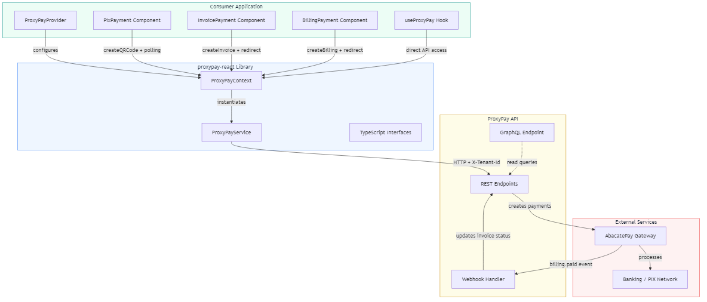

# ProxyPay React — Payment Components for React


## Overview

**proxypay-react** is a lightweight React component library for integrating payment processing via the ProxyPay API. It provides ready-to-use components for **PIX QR Code payments** (with modal, polling and status tracking), **Invoice payments** (redirect-based), and **recurring Billing subscriptions** — all fully typed with TypeScript and shipping as ESM + CJS with zero runtime dependencies beyond React.

The library follows a **Provider → Context → Hook → Component** architecture, making it simple to drop into any React application. An included `example-app/` demonstrates full integration with an admin dashboard featuring store management, customer lists, invoices, billings, and balance tracking.

---

## 🚀 Features

- ⚡ **PIX QR Code Payments** — Generates QR code via API, displays in a customizable modal with copy-paste code and expiration timer
- 🔄 **Automatic Status Polling** — Configurable interval polling that detects payment confirmation, expiration, and cancellation
- 🧾 **Invoice Payments** — Creates one-time invoices with redirect to AbacatePay payment page (PIX, Boleto, Credit/Debit Card)
- 📋 **Recurring Billing** — Subscription management with configurable frequency (Monthly, Quarterly, Semiannual, Annual)
- 🔒 **Multi-Tenant Support** — Built-in `X-Tenant-Id` header handling for multi-tenant architectures
- 📦 **Zero Dependencies** — Only React as peer dependency. No external QR code, UI, or modal libraries
- 🛡️ **Fully Typed** — Complete TypeScript interfaces for all API requests, responses, and component props
- 🎨 **Customizable Modal** — CSS class overrides for overlay and modal container
- 🪶 **Lightweight** — Under 8KB gzipped with tree-shaking support

---

## 🛠️ Technologies Used

### Core
- **React** ≥ 18 — UI library (peer dependency)
- **TypeScript** 5.7 — Static typing and interfaces

### Build Tooling
- **Vite** 8 — Library build with ESM + CJS output
- **vite-plugin-dts** — Automatic `.d.ts` declaration generation with rollup

### Versioning & CI/CD
- **GitVersion** — Semantic versioning based on commit messages
- **GitHub Actions** — Automated version tagging, release creation, and NPM publishing

---

## 📁 Project Structure

```
proxypay-react/
├── src/                          # Library source code
│   ├── types/
│   │   └── payment.ts            # All TypeScript interfaces, enums, and props
│   ├── services/
│   │   └── proxyPayService.ts    # API client class (REST calls)
│   ├── contexts/
│   │   └── ProxyPayContext.tsx   # React context provider
│   ├── hooks/
│   │   └── useProxyPay.ts       # Typed context consumer hook
│   ├── components/
│   │   ├── PixPayment.tsx        # PIX modal + QR code + polling
│   │   ├── InvoicePayment.tsx    # Invoice redirect component
│   │   └── BillingPayment.tsx    # Billing subscription component
│   └── index.ts                  # Public API surface (all exports)
├── example-app/                  # Full admin dashboard demo
│   └── src/
│       ├── pages/                # Dashboard, Store, Customers, Invoices, Billings, Demos
│       ├── contexts/             # Store, Balance, Customer, Invoice, Billing contexts
│       ├── hooks/                # Custom hooks per entity
│       ├── services/             # API services (REST + GraphQL)
│       └── types/                # Example app type definitions
├── docs/                         # Documentation
│   ├── API_REFERENCE.md          # Complete REST & GraphQL API reference
│   ├── system-design.mmd        # Architecture diagram (Mermaid source)
│   └── system-design.png        # Architecture diagram (rendered)
├── .github/workflows/            # CI/CD pipelines
│   ├── version-tag.yml           # Auto-versioning on push to main
│   ├── create-release.yml        # GitHub release on minor/major bumps
│   └── npm-publish.yml           # NPM publish after version tag
├── dist/                         # Built output (ESM + CJS + .d.ts)
├── GitVersion.yml                # Versioning strategy config
├── vite.config.ts                # Library build configuration
├── tsconfig.json                 # TypeScript configuration
└── package.json                  # Package metadata and scripts
```

---

## 🏗️ System Design

The following diagram illustrates the architecture of **proxypay-react** and how it integrates with the ProxyPay API and AbacatePay payment gateway:



**Consumer Application** uses the library components (`PixPayment`, `InvoicePayment`, `BillingPayment`) or the `useProxyPay` hook, which communicate through `ProxyPayContext` → `ProxyPayService` → ProxyPay REST API. The API creates payments on AbacatePay, which processes transactions through the banking/PIX network and sends webhook events back to update invoice statuses.

> 📄 **Source:** The editable Mermaid source is available at [`docs/system-design.mmd`](docs/system-design.mmd).

---

## 📖 Additional Documentation

| Document | Description |
|----------|-------------|
| [API Reference](docs/API_REFERENCE.md) | Complete REST & GraphQL API reference with DTOs, enums, filtering, sorting, and query examples |

---

## 🔧 Installation

```bash
npm install proxypay-react
```

**Peer dependencies:** `react` ≥ 18 and `react-dom` ≥ 18.

---

## 📚 Usage

### 1. Wrap with Provider

```tsx
import { ProxyPayProvider } from "proxypay-react";

function App() {
  return (
    <ProxyPayProvider
      config={{
        baseUrl: "https://api.sandbox.proxypay.co.ao",
        clientId: "your-client-id",
        tenantId: "your-tenant",
      }}
    >
      {/* your components */}
    </ProxyPayProvider>
  );
}
```

### 2. PIX Payment (Modal + Polling)

```tsx
import { PixPayment, type CustomerInfo, type InvoiceItem } from "proxypay-react";

const customer: CustomerInfo = {
  name: "Maria Santos",
  documentId: "98765432100",
  cellphone: "21988887777",
  email: "maria@email.com",
};

const items: InvoiceItem[] = [
  {
    id: "CURSO-001",
    description: "Curso de React Avancado",
    quantity: 1,
    unitPrice: 297.0,
    discount: 0,
  },
];

function Checkout() {
  return (
    <PixPayment
      customer={customer}
      items={items}
      pollInterval={10000}
      modalTitle="Finalizar Pagamento"
      onSuccess={(status) => console.log("Paid!", status)}
      onError={(error) => console.error(error)}
      onStatusChange={(status) => console.log("Status:", status.statusText)}
    >
      <button>Pagar R$ 297,00 com PIX</button>
    </PixPayment>
  );
}
```

### 3. Invoice Payment (Redirect)

```tsx
import { InvoicePayment, PaymentMethod } from "proxypay-react";

<InvoicePayment
  customer={customer}
  items={items}
  paymentMethod={PaymentMethod.CreditCard}
  completionUrl="https://mysite.com/success"
  returnUrl="https://mysite.com/checkout"
  onError={(err) => console.error(err)}
>
  <button>Pagar com Cartao</button>
</InvoicePayment>
```

### 4. Billing / Subscription (Redirect)

```tsx
import { BillingPayment, BillingFrequency, PaymentMethod } from "proxypay-react";

<BillingPayment
  customer={customer}
  items={billingItems}
  frequency={BillingFrequency.Monthly}
  paymentMethod={PaymentMethod.CreditCard}
  billingStartDate="2026-04-01T00:00:00"
  completionUrl="https://mysite.com/success"
  returnUrl="https://mysite.com/plans"
  onError={(err) => console.error(err)}
>
  <button>Assinar Plano Mensal</button>
</BillingPayment>
```

### 5. Direct API Access via Hook

```tsx
import { useProxyPay } from "proxypay-react";

function CustomPayment() {
  const { createQRCode, checkQRCodeStatus, createInvoice, createBilling } = useProxyPay();

  async function handlePay() {
    const qr = await createQRCode(customer, items);
    console.log(qr.brCode);       // PIX copy-paste code
    console.log(qr.brCodeBase64); // QR code base64 image

    const status = await checkQRCodeStatus(qr.invoiceId);
    console.log(status.paid);     // true/false
  }

  return <button onClick={handlePay}>Custom Payment</button>;
}
```

---

## 📦 Exported API

### Components

| Component | Description |
|-----------|-------------|
| `ProxyPayProvider` | Context provider — wraps the app with API configuration |
| `PixPayment` | PIX QR code modal with automatic status polling |
| `InvoicePayment` | One-time payment with redirect to payment page |
| `BillingPayment` | Recurring subscription with redirect to payment page |

### Hook

| Hook | Description |
|------|-------------|
| `useProxyPay()` | Direct access to `createQRCode`, `checkQRCodeStatus`, `createInvoice`, `createBilling` |

### Enums

| Enum | Values |
|------|--------|
| `PaymentMethod` | `Pix (1)`, `Boleto (2)`, `CreditCard (3)`, `DebitCard (4)` |
| `BillingFrequency` | `Monthly (1)`, `Quarterly (2)`, `Semiannual (3)`, `Annual (4)` |

### Types

`ProxyPayConfig`, `CustomerInfo`, `InvoiceItem`, `BillingItem`, `QRCodeResponse`, `QRCodeStatusResponse`, `InvoiceRequest`, `InvoiceResponse`, `BillingRequest`, `BillingResponse`, `InvoiceStatus`, `PixPaymentProps`, `InvoicePaymentProps`, `BillingPaymentProps`, `ProxyPayContextValue`

---

## ⚙️ Example App

The `example-app/` directory contains a full admin dashboard demonstrating the library in a real application with authentication, store management, and payment demos.

### Environment Setup

```bash
cd example-app
cp .env.example .env
```

Edit `.env`:

```bash
VITE_API_BASE_URL=https://api.sandbox.proxypay.co.ao  # ProxyPay API URL
VITE_NAUTH_API_URL=http://localhost:5000               # Auth service URL
VITE_CLIENT_ID=00000000000000000000000000000000         # Store client ID
VITE_TENANT_ID=example-tenant                           # Tenant identifier
```

### Running

```bash
cd example-app
npm install
npm run dev
```

### Pages

| Route | Page | Description |
|-------|------|-------------|
| `/` | Home | Landing page with features and quick start |
| `/docs` | Docs | Component documentation and API reference |
| `/demo/pix` | Demo PIX | Interactive PIX payment testing |
| `/demo/invoice` | Demo Invoice | Invoice payment testing |
| `/demo/billing` | Demo Billing | Subscription billing testing |
| `/admin/dashboard` | Dashboard | Balance overview and quick links |
| `/admin/store` | Store | Create/edit store configuration |
| `/admin/customers` | Customers | Paginated customer list |
| `/admin/invoices` | Invoices | Paginated invoice list with status badges |
| `/admin/billings` | Billings | Paginated billing subscriptions list |

---

## 🔧 Development

### Library (root)

```bash
npm run build          # Build library → dist/ (ESM + CJS + .d.ts)
npm run dev            # Watch mode build
npm run typecheck      # TypeScript type checking
npm run lint           # ESLint
```

### Example App

```bash
cd example-app
npm run dev            # Vite dev server
npm run build          # TypeScript check + production build
npm run lint           # ESLint
```

---

## 🔄 CI/CD

### GitHub Actions

The project uses four chained workflows triggered automatically on every push to `main`:

```
push to main → Version and Tag → Create Release → Update Version → Publish to NPM
```

| Workflow | Trigger | Description |
|----------|---------|-------------|
| **Version and Tag** | Push to `main` | Runs GitVersion to determine semantic version, creates and pushes git tag |
| **Create Release** | After Version and Tag succeeds | Creates GitHub Release with auto-generated notes (minor/major bumps only) |
| **Update Version** | After Create Release succeeds | Updates `package.json` version and commits to `main` |
| **Publish to NPM** | After Update Version succeeds | Builds the library and publishes to NPM registry |

### Versioning Strategy

Uses **GitVersion** with commit message conventions:

| Prefix | Bump | Example |
|--------|------|---------|
| `major:` or `breaking:` | Major | `major: remove deprecated API` |
| `feat:` or `feature:` | Minor | `feat: add billing component` |
| `fix:` or `patch:` | Patch | `fix: polling timeout issue` |

---

## 🤝 Contributing

Contributions are welcome! Please feel free to submit a Pull Request.

### Development Setup

1. Fork the repository
2. Create a feature branch (`git checkout -b feature/AmazingFeature`)
3. Make your changes
4. Run checks (`npm run typecheck && npm run lint`)
5. Commit your changes (`git commit -m 'feat: add some AmazingFeature'`)
6. Push to the branch (`git push origin feature/AmazingFeature`)
7. Open a Pull Request

### Coding Standards

- Follow the **types → services → contexts → hooks → components** architecture
- All exports must go through `src/index.ts`
- No runtime dependencies — only React as peer dependency
- Full TypeScript strict mode

---

## 👨‍💻 Author

Developed by **[Emagine](https://github.com/emaginebr)**

---

## 📄 License

This project is licensed under the **MIT License** — see the [LICENSE](LICENSE) file for details.

---

## 📞 Support

- **Issues**: [GitHub Issues](https://github.com/emaginebr/proxypay-react/issues)
- **Repository**: [github.com/emaginebr/proxypay-react](https://github.com/emaginebr/proxypay-react)

---

**⭐ If you find this project useful, please consider giving it a star!**
